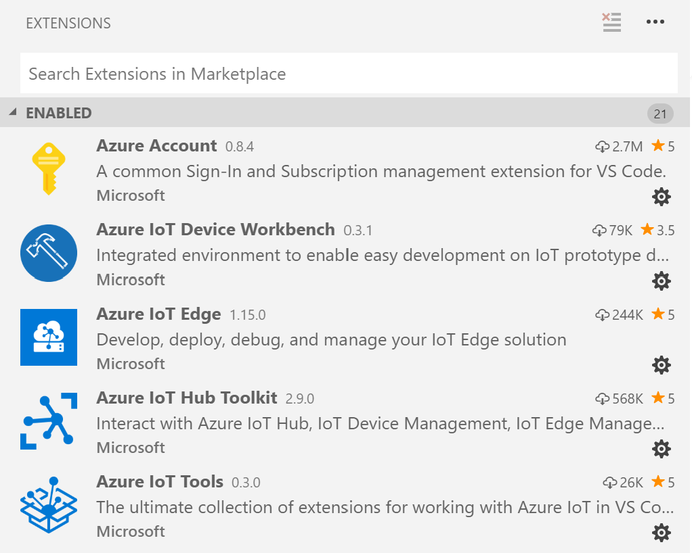
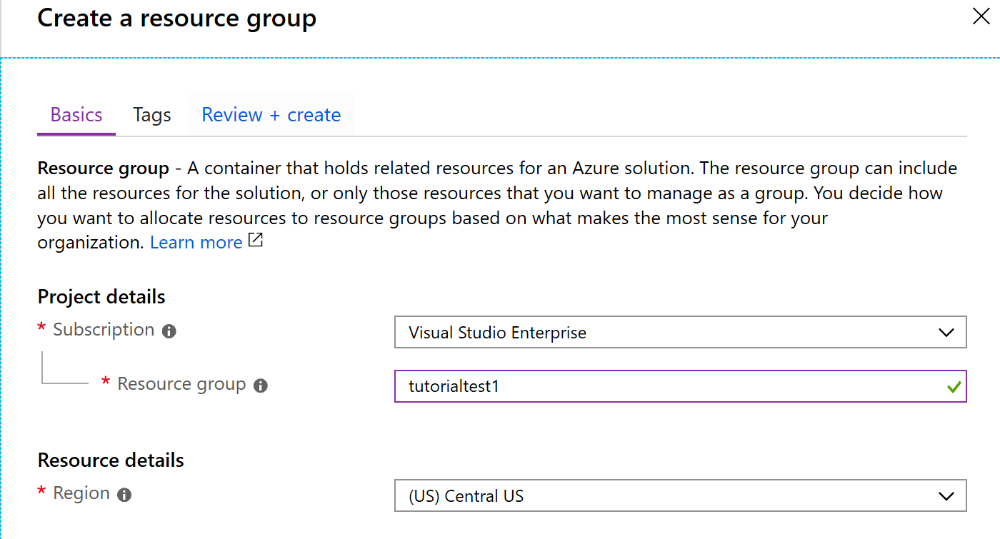
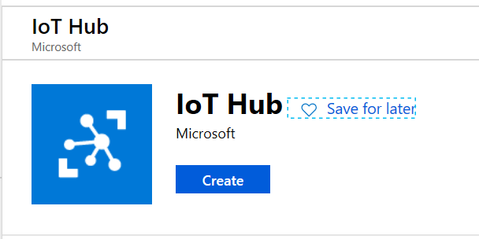
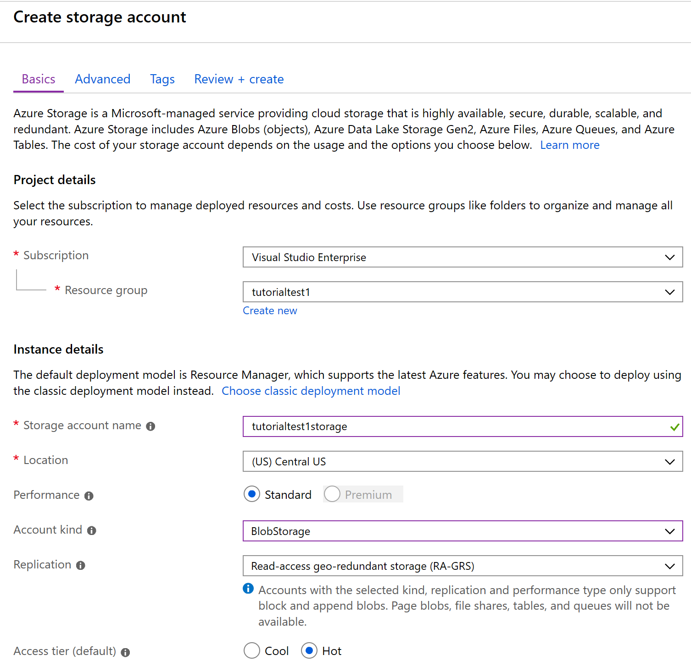
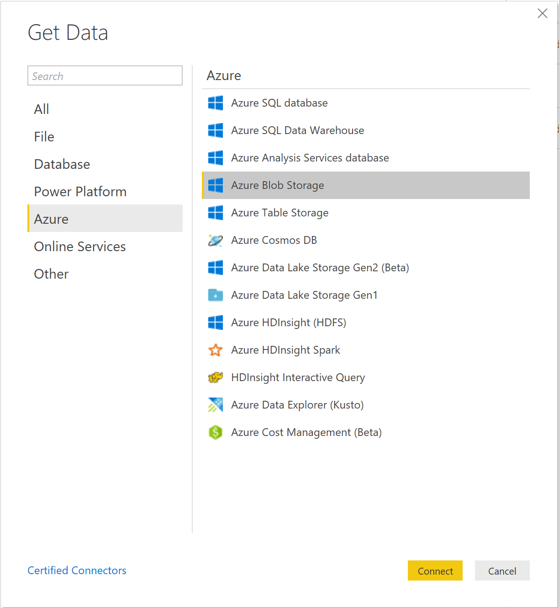

## Reference implementation for deploying ONNX Models to Intel OpenVINO based devices with ONNX Runtime and Azure IoT Edge

In this tutorial, you will learn how to deploy an ONNX Model to an IoT Edge device based on Intel platform, using ONNX Runtime for HW acceleration of the AI model.
By completing this tutorial, you will have a low-cost DIY solution for object detection within a space and a unique understanding of integrating ONNX Runtime with Azure IoT services and machine learning.
<p align="center"></p>

Skip [ahead](#get_started) if you already have the setup to work with Visual Studio and Azure services. 

### Prerequisites
#### 1. [Download Visual Studio Code](https://code.visualstudio.com/)

This tutorial uses Visual Studio Code to connect to your device and hub to deploy modules.

You will also need to install Visual Code Extensions. To find them, open Visual Studio Code and select the square **Extensions** icon. Search for and install the following:

* Azure Account
* Azure IoT Device Workbench
* Azure IoT Edge
* Azure IoT Hub Toolkit
* Azure IoT Tools
* Anaconda Extension

<p align="center"></p>

#### 2. Download Docker Desktop CE for [Windows](https://docs.docker.com/docker-for-windows/install/) or [Mac](https://docs.docker.com/docker-for-mac/). For Windows, do *not* check the box to use Windows containers rather than Linux containers.
<p align="center"></p>

* You will need to create a Docker account if you do not already have one.

This installer is ~500MB so it will take a while to download over Wi-Fi (about 30 minutes). *_Note_*: The installer will log you out immediately after the install is complete. This is okay.

* *If you would like to learn more about Docker, see the Resources section at the bottom of the document.*

#### 3. An Azure Account Subscription (with pre-paid credits or billing through existing payment channels)

### Overview on how to set up the Azure portal

#### Create an Azure account by following [this tutorial](https://azure.microsoft.com/en-us/free/)
* Your subscription must have pre-paid credits or bill through existing payment channels. (If you make an account for the first time, you can get 12 months free and $200 in credits to start with.)

#### Create a resource group
* In your Azure portal on the left side, go to **Resource Groups** and choose **Add**.

<p align="center"></p>

* Select the subscription that came with your Azure account and name your resource group using only lowercase alphanumeric characters. This is important because some later parts of this setup may be sensitive to non-alphanumeric and/or uppercase characters.

* **Important:** Take note of the subscription, resource group and resource data center location you selected. You should use the same location for the following resources you create.

* After you have created the resource group, select it.

#### Create an IoT hub

<p align="center"></p>
<p align="center"></p>

* Within your resource group, from the navigation bar at the top, select **Add** and search for **"IoT Hub"**.
  * Select **Create**.

* Fill out the fields with the information you recently gathered
  * Subscription: Same as in the previous step
  * Resource Group: Same as in the previous step
  * Region: Same as in the previous step
  * IoT Hub Name: Choose a name

<p align="center"></p>

* Keep all the other defaults and select **Review + Create** then select **Create**.

#### <a name="container_reg"></a>Create a container registry

  * In the search bar at the top of the page, search **Container Registry** and select it.

  * In the top navigation bar, select **Add**.

<p align="center"></p>

* Fill out the necessary fields
  * Name: What you want your container to be named
  * Subscription: Same as in previous step
  * Resource Group: Same as in the previous step
  * Location: Same as in previous step
  * Admin user: Enable
  * SKU: Standard

* Select **Create**.

* Note down the **Username** and **Login server**. Enable **Admin User**; this should generate two passwords. To find these credentials, go to your Azure Portal. Go to **Your resource group > Your container registry > Access keys**. The first password is the one you need to note. 

#### Create a storage account and storage container

* On the left navigation pane, select **Storage Accounts**.

* In the top navigation bar, select **Add**.

* Fill out the fields for project details
    * Subscription: Same as in previous step
    * Location: Same as in previous step
    * Name: *Must be lowercase and alphanumeric characters with a length of 3 to 24 characters*
    * Performance: Standard
    * Account kind: BlobStorage
    * Replication: Read-access geo-redundant storage (RA-GRS)
    * Access tier: Hot (default)
<p align="center"></p>

* Select **Create**

* In the left navigation pane in your storage account, select **Blobs**

* Select the **+ Container** button to create a new storage container (i.e. storagetest). *The name must be lowercase, alphanumeric and dash characters with a length of 3 to 63.*

* Select **OK** to finish creating the container.

### <a name="get_started"></a>Build the ONNX Runtime + OpenVINO base container image

a. Build the base container image using the [Dockerfile.openvino](https://github.com/microsoft/onnxruntime/blob/master/dockerfiles/Dockerfile.openvino) from the [ONNX Runtime Github repo](https://github.com/microsoft/onnxruntime).

b. Push this container image to your container registry created [above](#container_reg) using the following commands:

    `docker login -u <username> -p <password> <registry_address>`
    `docker tag <Login_server/tag_onxxruntime_base_image> <image ID of the container created in _a._>`
    `docker push <tag for the base image created above>`

This base image will be used to create the application containers in Visual Studio Code.

### Model deployment With ONXN Runtime + OpenVINO

This part focuses on deploying an object detection model on your IoT Edge device using ONNX models.

* Clone this repo to your local drive / computer.

#### Module Deployment

* If using a different desktop PC for VS Code, you must login to your registry created [above](#container_reg). To do this, ensure that the Docker application is running on your desktop and that you are signed in. To sign in, using the Terminal of VS Code, run the command in the terminal of VS code:

    `docker login -u <username> -p <password> <registry_address>`

* You should see a 'Login Succeeded' message.

* Pull the ONNX Runtime base image to your desktop's registry: `docker pull <full_path_of_the_ONNX_Runtime_base_image>`

* On your computer, open the folder for this repo in VS Code.
    * *Note: If you downloaded as a zip file, there may be two ARM64_EdgeSolution folders when you unzip, one nested in the other. Open the **INNER** one*

    * Select **View > Command Palette** to open the VS Code command palette.

    * In the command palette, enter and run the command **Azure: Sign in** and follow the instructions to sign into your Azure account.

    * Open the **.env** file and replace _username_, _password_ and _login server_ with the credentials of the container registry that was set up [above](#container_reg).

    * Fill in the **.env** file so that it now looks something like this:

    ```
    CONTAINER_REGISTRY_USERNAME="<_username_>"
    CONTAINER_REGISTRY_PASSWORD="<_password_>"
    CONTAINER_REGISTRY_ADDRESS="<_Login server_>"
    ```

    * In the **CameraCaptureModule** directory, edit the file **camerainfo.csv** so that each line holds the camera number and the name of the camera delimited with a ','. The current csv is set for a camera with the name _cam1_ and camera number _0_.
    
    * In the _Dockerfile.amd64_ in each sub-folder withing _modules_ replace the `mcr.microsoft.com/azureml/onnxruntime:v0.4.0` with the _full path to the ONNX Runtime + OpenVINO base image_. *Note:* the dockerfiles are setup to use the CPU-only version of the ONNX Runtime base image as default.

#### Cloud storage

 * Within the InferenceModule directory, main.py is the file in which blob storage is set up as well. By default, we are going to use blob storage and we have created the necessary resources for it. If you do not wish to use it, change the variable **CLOUD_STORAGE** to **False**.

 * Then in your deployment.template.json file, find the last occurrence of `azureblobstorageoniotedge`. This is where the device twin properties of your blob storage module are set.

 * Change the **cloudStorageConnectionString** variable to your cloud storage connection where it has `"<insert cloud storage connection string here>"`. You can find the connection string on the portal in your storage account under the **Access Keys** tab.

 * Change the variable **LOCAL_STORAGE_ACCOUNT_NAME** to the container you created in your storage account during **phase one** (i.e. storagetestlocal).

 * Change the variable **LOCAL_STORAGE_ACCOUNT_KEY** to your generated local storage account key. You can use this generator [here](https://generate.plus/en/base64?gp_base64_base%5Blength%5D=64).

 * In the InferenceModule directory, in main.py adjust the variable **block_blob_service** to hold the connection string to the local blob storage account. You can find information about configuring connection strings [here](https://docs.microsoft.com/en-us/azure/storage/common/storage-configure-connection-string#create-a-connection-string-for-an-explicit-storage-endpoint) or just replace the given `< >` with what is required.

 * Run `sudo mkdir /home/storagedata` in the SSH terminal.

#### Switch the VSCode configuration to amd64

 * In **.vscode/settings.json** replace _arm64_ with **amd64**.

 * Copy **deployment-amd64.template.json** to **deployment.template.json**

#### Deploy to Device

* Right click on **deployment.template.json**, then select **Build and Push IoT Edge Solution**. Behind the scenes, this runs two docker commands. One to build your container and another to push that to the container registry. _This step may take some time (15 minutes)_
        * *Note: Every time changes are made and you want to re-deploy the modules the version of the module must be incremented or changed. In **module.json** change the version number before selecting **Build and Push IoT Edge Solution.***

* At the bottom left corner of VS Code, you should see a drop-down menu labeled **AZURE IOT HUB**. Expand it and select **IoT Hub**. Follow the prompts that appear in the command palette at the top and select the IoT Hub you created.

* After selecting the hub, click on the **Devices** drop down menu. You should be able to see your device like this:

* Right click on the device and select **Create Deployment for Single Device**. This will open a File Explorer window. Navigate into the **config** folder and select the **deployment.amd64.json** file.

* You can verify that the _PreModule_ and _InferenceModules_ are running by typing the command `sudo iotedge list` on the IoT Edge device terminal. It should yield something like this (your module versions may be different):

* To view the output of the model in VS Code, select on the device in the Azure IoT Hub device menu and select **Start Monitoring Built-in Event Endpoint**. Your terminal should look like this:

 <p align="center"></p>

* You should be able to see the output. You can select on the lock icon in the top right corner to lock the toggle at the bottom of the terminal window; now you can see the output in real time:

 <p align="center"></p>

* Once your modules are up and running on your Iot Edge device, you should be able to see inference outputs on the portal in your storage account!

* Go to your storage account and select the **Blobs** tab.

* There should be a storage container called **storagetest**. Select it and you will see your results stored as blobs!

* To see what's in a blob, select it and then select **Edit Blob**

<p align="center"></p>

### *Note*

* *The output being displayed only shows the labels and confidence scores for objects above a threshold confidence score.*

* *The output of the TinyYOLO model contains more information such as the confidence scores for each of the 20 labels and the coordinates of the detected objects in the frame. If you would like to see this additional information, feel free to modify the Inference Python file in the **ARM64_EdgeSolution**.*

## Troubleshooting
If you don't see your module as 'Running':
* Run `sudo journalctl -u iotedge -f` and see if the image is being pulled. 

* If you do not see any modules running, restart iotedge with `systemctl restart iotedge`, then check again.

For further debugging, you can try these commands:
* Run `sudo systemctl status iotedge` to view the **status** of the IoT Edge Security Manager.

* Run `sudo journalctl -u iotedge -f` to view the **logs** of the IoT Edge Security Manager.

* Run `sudo docker logs <module name>` to view specific error logs for a module

For more help on troubleshooting Azure IoT Edge, go [here](https://docs.microsoft.com/en-us/azure/iot-edge/troubleshoot).

### Visualizing Data in Power BI via Azure

This step focuses on visualizing the data being gathered by the model and stored in Azure Blob Storage using Power BI to display.

**Prerequisites**
[Download and launch Power BI Desktop](https://powerbi.microsoft.com/en-us/desktop/)

#### Visualization & Publishing

  * Connect to your Azure Blob Storage Account by selecting **Get Data**.
  <p align="center"></p>

  * Follow the setup as it asks for the storage account name and connection string. The connection string can be found under **Access Keys** in your storage account resource.

  * Select the container with the data you want to load.

  * If you want to select any particular columns/rows or clean up any data headers (and we suggest you do this to make the visualization process easier), select **Transform Data**. Otherwise, to load all raw data, select **Load**.

  <!-- Image must be changed due to namings -->
  <p align="center"></p>

  * Once the blob(s) is loaded, select **Binary** in the table to adjust the Power Query.

  * After you are finished, select **Close and Apply**.
  <p align="center"></p>

  * Spend some time exploring different visualizations in Power BI and choose one you want to use for your data or [create your own](https://docs.microsoft.com/en-us/power-bi/power-bi-custom-visuals)! A good place to start is with the **New Visual** feature found on the **Home** tab.

For inspiration and ideas on how to visualize your data, visit [Power BI's theme gallery.](https://community.powerbi.com/t5/Themes-Gallery/bd-p/ThemesGallery)

For more details on formatting, please visit [this blog post](https://sharepointmike.wordpress.com/2015/10/03/formatting-power-bi-visualizations/) on formatting Power BI visualizations.

After you have finished making your visualization, you can **publish** your report by following [this tutorial](https://docs.microsoft.com/en-us/power-bi/desktop-upload-desktop-files).

#### Troubleshooting

For help troubleshooting on Power BI, please visit [Power BI's documentation site](https://docs.microsoft.com/en-us/power-bi/) to learn more.

For technical help, please visit [Power BI's support page](https://powerbi.microsoft.com/en-us/support/).

### Next steps & resources

**Here are some ideas about how to continue your project**

* Deploy your own model!
    * Check out ONNX's pre-made model zoo [here](https://github.com/onnx/models) for models to download and deploy.
    * Create your own model using [Azure Machine Learning](https://docs.microsoft.com/en-us/azure/machine-learning/service/tutorial-train-models-with-aml) or [Custom Vision](https://www.customvision.ai/).

* Create a dashboard for your Power BI report by following [this tutorial](https://docs.microsoft.com/en-us/power-bi/service-dashboard-create).

#### Resources: Here are some resources for extra learning and exploring

* [An example of how to set up a simple Docker container](https://docs.docker.com/get-started/)
    * [Learn more about Docker containers](https://www.docker.com/resources/what-container)

* [Learn more about Azure IoT Edge](https://azure.microsoft.com/en-us/services/iot-edge/)

* [Tips and tricks for creating reports with Power BI](https://docs.microsoft.com/en-us/power-bi/power-bi-reports-tips-and-tricks-for-creating)

* [Learn more about Azure Blob Storage and Power BI](http://www.gastoncruz.com/2016/09/17/power-bi-azure-blob-storage/)
