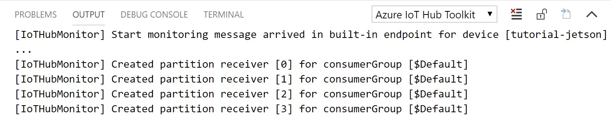

## Reference implementation for deploying ONNX Models to Intel OpenVINO based devices with ONNX Runtime and Azure IoT Edge

In this tutorial, you will learn how to deploy an ONNX Model to an IoT Edge device based on Intel platform, using ONNX Runtime for HW acceleration of the AI model.
By completing this tutorial, you will have a low-cost DIY solution for object detection within a space and a unique understanding of integrating ONNX Runtime with Azure IoT services and machine learning.
<p align="center"></p>


[Setup Azure account and Visual Studio enviroment](./README-Setup.md) or skip to [Model deployment](#get_started) if you already have the setup to work with Visual Studio and Azure services. 

### <a name="setup_UP2"></a>Phase One: Setup the UP<sup>2</sup> AI Vision Developer Kit

This phase will help you to setup the UP<sup>2</sup> device for using with this tutorial. Equipment needed for this setup are:

1. [UP<sup>2</sup> AI Vision Kit](https://up-shop.org/home/285-up-squared-ai-vision-x-developer-kit.html#/116-up_squared_ai_vision_x_developer_kit-version_b_w_myriad_x) (make sure that you are using the version B kit with Myriad X option)
2. A USB mouse and USB keyboard
3. Ethernet (cat 6) cable or the [WiFI Kit for the UP<sup>2</sup>](https://up-shop.org/up-peripherals/239-m2-2230-wifi-kit-2t2r-for-up-squared-metal-chassis.html)
4. A monitor with HDMI or Display Port (DP) interface

Configure the Neural Compute Stick in the UP</sup>2</sup> device using [these steps](https://docs.openvinotoolkit.org/2019_R1.1/_docs_install_guides_installing_openvino_linux.html#additional-NCS-steps).
    
    sudo usermod -a -G users "$(whoami)"
    sudo cp /opt/intel/openvino/inference_engine/external/97-myriad-usbboot.rules /etc/udev/rules.d/
    sudo udevadm control --reload-rules
    sudo udevadm trigger
    sudo ldconfig

To display the inference output on the local display, add __xhost +__ to the `/home/$user/.profile` file.

### <a name="get_started"></a>Phase Two: Model deployment With ONXN Runtime + OpenVINO

This part focuses on deploying an object detection model on your IoT Edge device using a pretrained model from the ONNX model zoo.

* Clone this repo to your local drive / computer.

#### Module Deployment

* If using a different desktop PC for VS Code, you must login to your registry created in [this](./README-Setup.md#create-a-container-registry) step. To do this, ensure that the Docker application is running on your desktop and that you are signed in. To sign in, using the Terminal of VS Code, run the command in the terminal of VS code:


    `docker login -u <username> -p <password> <registry_address>`

* You should see a 'Login Succeeded' message.

* On your computer, open the folder for this repo in VS Code.
    * Note: If you downloaded as a zip file, there may be two *onnxruntime-iot-edge-master* folders when you unzip, one nested in the other. Open the **INNER** one

    * Select **View > Command Palette** to open the VS Code command palette.

    * In the command palette, enter and run the command **Azure: Sign in** and follow the instructions to sign into your Azure account.

    * Open the **.env** file and replace _username_, _password_ and _login server_ for the _CONTAINER_REGISTRY_ variables with the credentials of the container registry that was set up in [this](./README-Setup.md#create-a-container-registry) step.
    
    * In the **.env** file replace the _Storage account name_ and _access key_ with the details of your Azure Storage account details.

    * Fill in the **.env** file so that it now looks something like this:

    ```
    CONTAINER_REGISTRY_USERNAME="<_username_>"
    CONTAINER_REGISTRY_PASSWORD="<_password_>"
    CONTAINER_REGISTRY_ADDRESS="<_Login server_>"
    MY_STORAGE_ACCOUNT_NAME="<_Storage account name_>"
    MY_STORAGE_ACCOUNT_KEY="<_access key_>"
    ```

    * In the **CameraCaptureModule** directory, edit the file **camerainfo.csv** so that each line holds the camera number and the name of the camera delimited with a ','. The current csv is set for a camera with the name _cam1_ and camera number _0_.

#### Cloud storage

 * Within the InferenceModule directory, main.py is the file in which blob storage is set up as well. By default, we are going to use blob storage and we have created the necessary resources for it. If you do not wish to use it, change the variable **CLOUD_STORAGE** to **False**.

 * In the **.env** file update the _MY_STORAGE_ACCOUNT_NAME_, _MY_STORAGE_ACCOUNT_KEY_ and _MY_STORAGE_CONNECTION_STRING_ entries with the details of your Azure Storage account details.

 * You can find the _Storage account name_, _access key_ and _Connection string_ on the Azure portal in your storage account under the **Access Keys** tab.

 * In the InferenceModule directory, in main.py adjust the variable **block_blob_service** to hold the connection string to the local blob storage account. You can find information about configuring connection strings [here](https://docs.microsoft.com/en-us/azure/storage/common/storage-configure-connection-string#create-a-connection-string-for-an-explicit-storage-endpoint) or just replace the given `< >` with what is required.

 * Run `sudo mkdir /home/storagedata` in the SSH terminal.
 
 ----
 
 After these steps the **.env** file should have the following variables with the appropriate values for your account:

    ```
    CONTAINER_REGISTRY_USERNAME="<username>"
    CONTAINER_REGISTRY_PASSWORD="<password>"
    CONTAINER_REGISTRY_ADDRESS="<Login server>"
    MY_STORAGE_ACCOUNT_NAME="<Storage account name>"
    MY_STORAGE_ACCOUNT_KEY="<access key>"
    MY_STORAGE_CONNECTION_STRING="<Connection string>"
    ```
    
#### Switch the VSCode configuration to amd64

 * In **.vscode/settings.json** replace _arm64_ with **amd64**.

 * Copy **deployment-amd64.template.json** to **deployment.template.json**

#### Deploy to Device

* Right click on **deployment.template.json**, then select **Build and Push IoT Edge Solution**. Behind the scenes, this runs two docker commands. One to build your container and another to push that to the container registry. _This step may take some time (15 minutes)_
        * *Note: Every time changes are made and you want to re-deploy the modules the version of the module must be incremented or changed. In **module.json** change the version number before selecting **Build and Push IoT Edge Solution.***

* At the bottom left corner of VS Code, you should see a drop-down menu labeled **AZURE IOT HUB**. Expand it and select **IoT Hub**. Follow the prompts that appear in the command palette at the top and select the IoT Hub you created.

* After selecting the hub, click on the **Devices** drop down menu. You should be able to see your device like this:

* Right click on the device and select **Create Deployment for Single Device**. This will open a File Explorer window. Navigate into the **config** folder and select the **deployment.amd64.json** file.

* You can verify that the _PreModule_ and _InferenceModules_ are running by typing the command `sudo iotedge list` on the IoT Edge device terminal. It should yield something like this (your module versions may be different):

* To view the output of the model in VS Code, select on the device in the Azure IoT Hub device menu and select **Start Monitoring Built-in Event Endpoint**. Your terminal should look like this:

 <p align="center"></p>

* You should be able to see the output. You can select on the lock icon in the top right corner to lock the toggle at the bottom of the terminal window; now you can see the output in real time:

 <p align="center"></p>

* Once your modules are up and running on your Iot Edge device, you should be able to see inference outputs on the portal in your storage account!

* Go to your storage account and select the **Blobs** tab.

* There should be a storage container called **storagetest**. Select it and you will see your results stored as blobs!

* To see what's in a blob, select it and then select **Edit Blob**

<p align="center"></p>

### *Note*

* *The output being displayed only shows the labels and confidence scores for objects above a threshold confidence score.*

* *The output of the TinyYOLO model contains more information such as the confidence scores for each of the 20 labels and the coordinates of the detected objects in the frame. If you would like to see this additional information, feel free to modify the Inference Python file in the **ARM64_EdgeSolution**.*

## Troubleshooting
If you don't see your module as 'Running':
* Run `sudo journalctl -u iotedge -f` and see if the image is being pulled. 

* If you do not see any modules running, restart iotedge with `systemctl restart iotedge`, then check again.

For further debugging, you can try these commands:
* Run `sudo systemctl status iotedge` to view the **status** of the IoT Edge Security Manager.

* Run `sudo journalctl -u iotedge -f` to view the **logs** of the IoT Edge Security Manager.

* Run `sudo docker logs <module name>` to view specific error logs for a module

For more help on troubleshooting Azure IoT Edge, go [here](https://docs.microsoft.com/en-us/azure/iot-edge/troubleshoot).

### Visualizing Data in Power BI via Azure

[This step](README-visualization.md) focuses on visualizing the data being gathered by the model and stored in Azure Blob Storage using Power BI to display.

#### Troubleshooting

For help troubleshooting on Power BI, please visit [Power BI's documentation site](https://docs.microsoft.com/en-us/power-bi/) to learn more.

For technical help, please visit [Power BI's support page](https://powerbi.microsoft.com/en-us/support/).

### Next steps & resources

**Here are some ideas about how to continue your project**

* Deploy your own model!
    * Check out ONNX's pre-made model zoo [here](https://github.com/onnx/models) for models to download and deploy.
    * Create your own model using [Azure Machine Learning](https://docs.microsoft.com/en-us/azure/machine-learning/service/tutorial-train-models-with-aml) or [Custom Vision](https://www.customvision.ai/).

* Create a dashboard for your Power BI report by following [this tutorial](https://docs.microsoft.com/en-us/power-bi/service-dashboard-create).

#### Resources: Here are some resources for extra learning and exploring

* [An example of how to set up a simple Docker container](https://docs.docker.com/get-started/)
    * [Learn more about Docker containers](https://www.docker.com/resources/what-container)

* [Learn more about Azure IoT Edge](https://azure.microsoft.com/en-us/services/iot-edge/)

* [Tips and tricks for creating reports with Power BI](https://docs.microsoft.com/en-us/power-bi/power-bi-reports-tips-and-tricks-for-creating)

* [Learn more about Azure Blob Storage and Power BI](http://www.gastoncruz.com/2016/09/17/power-bi-azure-blob-storage/)
