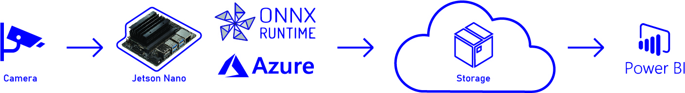
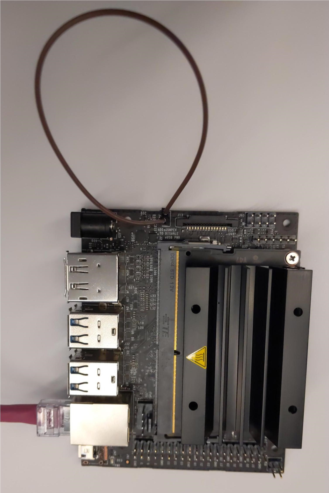
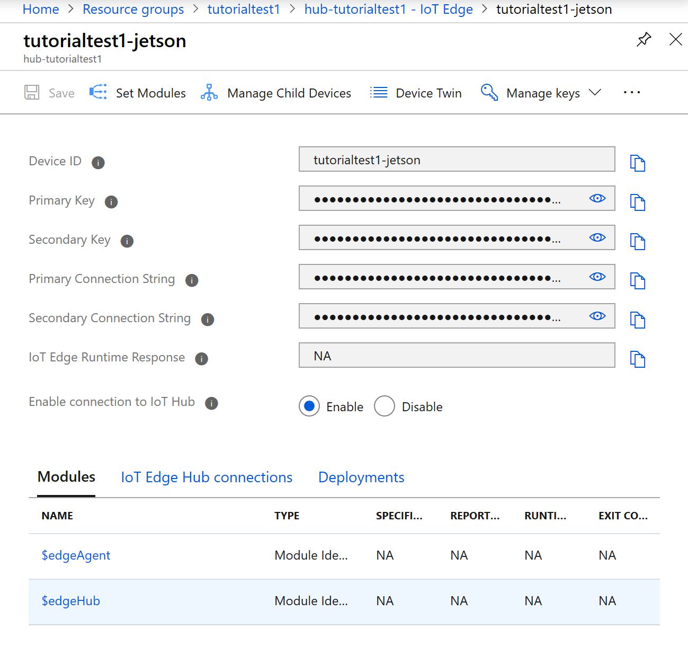
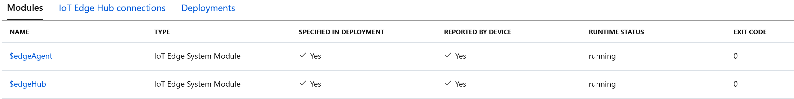
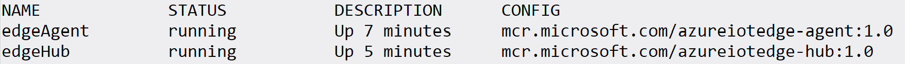
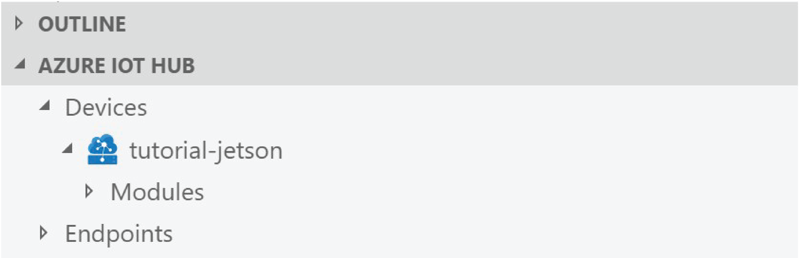
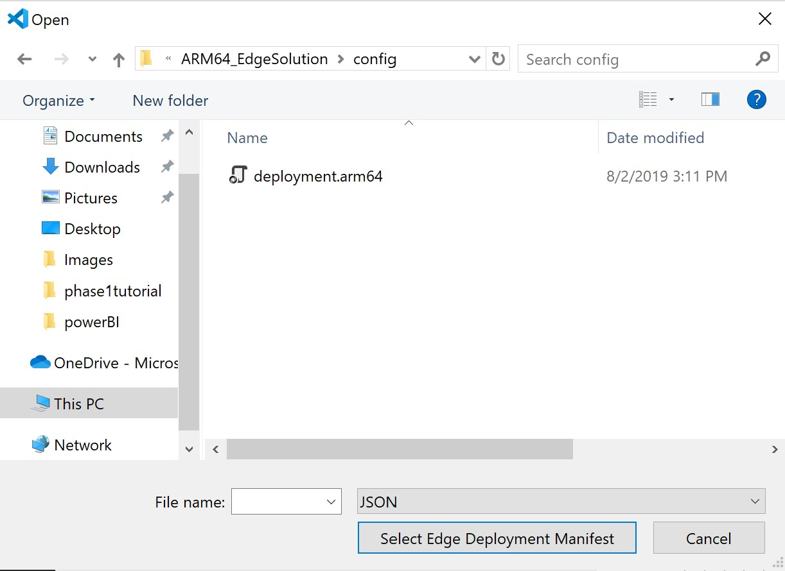
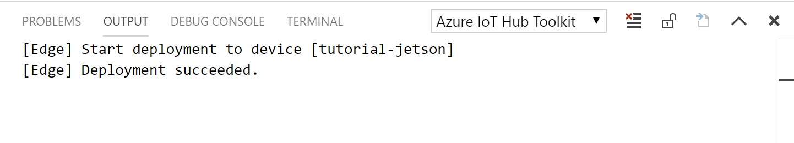
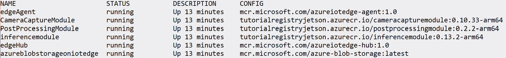
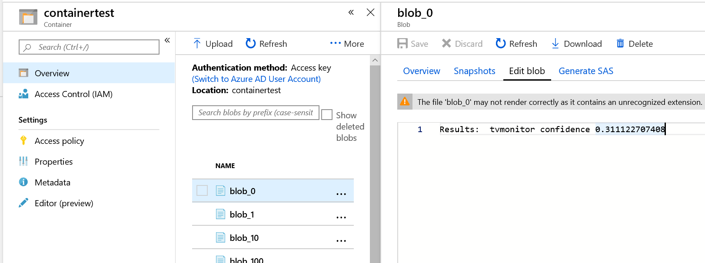

<p align="center"></p>

## Integrate Azure with machine learning execution on the Jetson Nano (an ARM64 device)

In this tutorial you will learn how to integrate Azure services with machine learning on the NVIDIA Jetson Nano (an ARM64 device) using Python. By the end of this sample, you will have a low-cost DIY solution for object detection within a space and a unique understanding of integrating ARM64 platform with Azure IoT services and machine learning.
<p align="center"></p>

* [Phase One](./README-Setup.md) focuses on setting up the related services and environment.
* [Phase Two](#p2) focuses on setting up the Jetson Nano to be ready for IoT Edge Development with Azure and ONNX Runtime.
* [Phase Three](#p3) focuses on deploying an IoT Edge module to the device (combining phases one and two together).
* [Phase Four](#p4) focuses on visualizing the data in Power BI via Azure Blob Storage.

# General prerequisites

## Recommended basic experience & knowledge
* Working with Azure
* Understanding the fundamentals of machine learning
* Working with ARM64 devices (such as the Jetson Nano)
* Coding in Python

## Time commitment
We expect the full tutorial to take an experienced developer ~3 hours.
* Phase one: ~60 minutes (~20 minutes of work, the rest is load time)
* Phase two: ~60 minutes (~20 minutes of work, the rest is load time)
* Phase three: ~30 minutes (~10 minutes of work, the rest is load time)
* Phase four: ~20 minutes (depending on your visualization needs)

# <a name="p1"></a>Phase One: Setting up the Azure Cloud Services
## Purpose
This step focuses on [setting up the Azure cloud components and the Visual Studio environment](./README-Setup.md). You can skip this step if you already have the setup to work with Visual Studio and Azure services.

# <a name="p2"></a>Phase Two: Setting up the Jetson Nano
## Purpose
Phase two focuses on setting up the Jetson Nano to be ready for IoT Edge Development with Azure and ONNX Runtime.

## Prerequisites
* [1 Jetson Nano](https://www.nvidia.com/en-us/autonomous-machines/embedded-systems/jetson-nano/)
* [1 32+ GB microSD card and a microSD to SD card adapter](https://www.target.com/p/centon-mp-essential-micro-sdxc-card-uhs1-64gb-black-s1-msdxu1-64g/-/A-52362226)
* [1 USB Mouse and USB Keyboard](https://www.staples.com/Logitech-MK120-Wired-Full-size-USB-Keyboard-and-Optical-Mouse-Combo-920-002565/product_886660)
* [1 Ethernet cable (cat 6)](https://www.bestbuy.com/site/dynex-25-cat-6-network-cable-gray/8313083.p?skuId=8313083)
* [1 USB camera](https://www.microsoft.com/accessories/en-us/products/webcams/lifecam-cinema/h5d-00013) or [1 IP camera](https://www.axis.com/en-ca/products/axis-p1245)
* 1 Laptop with SD card capability
* Highly recommended
    * [1 female-to-female jumper](https://www.adafruit.com/product/1951?gclid=EAIaIQobChMI6cyOtpTv4wIVhv5kCh0-Sg8LEAQYBCABEgKqn_D_BwE)
    * [1 5V barrel jack power supply, 20W](https://www.adafruit.com/product/1466)
    *  **Important:** If you are using the 5V barrel jack power supply, short the two pins on the Jetson right above the power jack to allow it to draw power from the power jack instead of the USB.

<p align="center"></p>

## Building the image
* Follow [these instructions from NVIDIA to flash your Jetson](https://developer.nvidia.com/embedded/learn/get-started-jetson-nano-devkit).
    * When you insert the MicroSD into your computer, a lot of windows and memory drives may pop up. Ignore them (or close them if you care) and continue with the flashing instructions.

* Once finished, turn on the Jetson and open the terminal **(ctrl + alt + t)**.
    * Attach the ethernet cable, power supply, female-to-female jumper cable, USB keyboard, USB mouse and HDMI cable to the Jetson.
    * Plug the ethernet cable into a functional ethernet port
    * Plug the power supply into a reliable outlet.
    * Plug the other side of the HDMI cable into the monitor and power it on.


* If a loading bar appears after logging on and does not move after a minute, just select **Cancel**.

* Ensure that the Jetson is connected to ethernet.

* Note the IP address of the Jetson by running the command:
    
    `ifconfig`
* Run the following command in terminal on the Jetson to disable the GUI:

    `sudo systemctl set-default multi-user.target`
   
    *Note: This change is critical to preserving RAM and GPU RAM space for deploying the ONNX model in phase three.*
* Reboot to apply this change. 

    `sudo reboot`

## SSH into the Jetson

* Once the Jetson starts up again, you should see a black monitor with white text at the top corner.
* On your own computer, type into terminal `ssh <Jetson user name>@<IP address>`. For example:

    `ssh myusername@10.123.12.12`

### *Note*
* *Install packages with `sudo apt-get install <PACKAGENAME>` as some packages may come preinstalled while others might not.*

* *OpenCV 3.3.1 should come preinstalled on the image provided by NVIDIA but if it is not, or you need a more updated version, you will have to build from source for ARM64.*

## Azure prerequisites

First, we will install the daemon and some prerequisites in order to register the Jetson as an IoT Edge device.

* Run this command:

    `sudo apt-get upgrade -y && sudo apt-get update -y`

    * *Note: This may take ~10 minutes. If prompted to restart, you should restart.*

* You will need to install curl: 
    
    `sudo apt-get install curl`

* Run apt-get fix:

    `sudo apt-get install -f`

* Install the iotedge daemon. Follow these instructions:
    * Register Microsoft key and software repository feed for **Ubuntu Server 18.04**

        `curl https://packages.microsoft.com/config/ubuntu/18.04/multiarch/prod.list > ./microsoft-prod.list`
    * Copy the generated list.
        `sudo cp ./microsoft-prod.list /etc/apt/sources.list.d/`

    * Install Microsoft GPG public key 
        `curl https://packages.microsoft.com/keys/microsoft.asc | gpg --dearmor > microsoft.gpg`

        `sudo cp ./microsoft.gpg /etc/apt/trusted.gpg.d/`

    * Perform apt update.
        `sudo apt-get update`

    * Install the security daemon. The package is installed at /etc/iotedge/.
        `sudo apt-get install iotedge`

        [source](https://docs.microsoft.com/en-us/azure/iot-edge/how-to-install-iot-edge-linux#configure-the-azure-iot-edge-security-daemon) for above instructions.

* (Optional) Verify your Linux kernel for Moby compatibility. 
  
## Connect your device to the IoT Hub

### Register a new IoT Edge device in your IoT Hub

* Register a new IoT Edge device in your IoT Hub by following [this tutorial](https://docs.microsoft.com/en-us/azure/iot-edge/how-to-register-device-portal).

* In your Azure IoT Hub the portal should look like this
<p align="center"></p>

* Be sure to note copy the **Primary Connection String** of your device as you will need it for the next step.

* From the SSH terminal, run this command:
  
  `sudo vim /etc/iotedge/config.yaml`

* Scroll until you see: `device_connection_string:"<ADD DEVICE CONNECTION STRING HERE>"` and paste the **Primary Connection String** in between the `""`.
    * This step establishes a connection from the IoT Hub to the Jetson Nano as an IoT Edge device. 

* Save and exit the file. Then restart iotedge:

  `sudo systemctl restart iotedge`.

* For the edgeHub module to run, there needs to be a deployment configured. Right now there are none so it will not be running. Later, when you build and push your modules to the device, this will generate a deployment to the edgeHub. Since we have not done this yet, but want to ensure both edgeHub and edgeAgent will run, we will create a blank deployment.

    * In the portal under the device, select **Set Modules**
    * Do not change anything, just select **Next** twice and then **Submit**

You should see the modules running successfully, keep in mind edgeHub can take several minutes to load. If not, see the Troubleshooting section at the end of this phase.

<p align="center"></p>

Running `sudo iotedge list` on the Nano should yield something like:  

<p align="center"></p>

## Troubleshooting

To fix internet connectivity issues where agent module (and other launched containers) are unable to connect to IoT Hub:  
* Run `sudo ln -sf /run/systemd/resolve/resolv.conf /etc/resolv.conf` on the host device. This points the resolve to the correct DNS servers.

If running `sudo iotedge list` did not yield the same output shown in the image above, try running one of these commands:
* Run `sudo systemctl status iotedge` to view the **status** of the IoT Edge Security Manager.
* Run `sudo journalctl -u iotedge -f` to view the **logs** of the IoT Edge Security Manager.

If you get a 400 error in your edgeAgent menu, there's a chance you typed something incorrectly in **Advanced Runtime Settings**. Make sure the iotedge list is correct word for word.

<!-- BEGIN may need to delete this?? -->
<!-- If you are connected inside Microsoft corp net (corp.microsoft.com) then check the `nameserve` entry in `/etc/resolv.conf`. Change to `nameserver: 10.50.10.50` in the `/etc/resolv.conf`. -->

<!-- END delete later -->

For more help on troubleshooting Azure IoT Edge, go [here](https://docs.microsoft.com/en-us/azure/iot-edge/troubleshoot).


# <a name="p3"></a>Phase Three: Model deployment
## Purpose

Phase three of this tutorial focuses on deploying an object detection model on your Jetson.

## Prerequisites
* Clone this repo to your local drive / computer.

If you completed phases one and two, you should have the following dependencies already. Feel free to double check them.
* Install Azure Account, Azure IoT Edge & Azure IoT Hub Toolkit extensions in VS Code.
	* These will allow you to build and push IoT Edge solutions to a custom container and view output from the Jetson in VS Code.

## Module Deployment
* On your computer (not the Jetson), open the folder for this repo in VS Code.
    * *Note: If you downloaded as a zip file, there may be two ARM64_EdgeSolution folders when you unzip, one nested in the other. Open the **INNER** one*

* Select **View > Command Palette** to open the VS Code command palette.

* In the command palette, enter and run the command **Azure: Sign in** and follow the instructions to sign into your Azure account.

* Open the **.env** file and replace it with the credentials of the container registry that was set up in **phase one**. To find these credentials, go to your Azure Portal. Go to **Your resource group > Your container registry > Access keys**.

* Note the **Username** and **Login server**. Enable **Admin User**; this should generate two passwords. The first password is the one you need to note. Fill in the **.env** file so that it now looks something like this:

```
CONTAINER_REGISTRY_USERNAME="<username>"
CONTAINER_REGISTRY_PASSWORD="<password>"
CONTAINER_REGISTRY_ADDRESS="<Login server>"
```

* In the **CameraCaptureModule** directory, edit the file **camerainfo.csv** so that each line holds the camera number and the name of the camera delimited with a ','. The current csv is set for a camera with the name _cam1_ and camera number _0_.

### Cloud storage
* Within the InferenceModule directory, main.py is the file in which blob storage is set up as well. By default, we are going to use blob storage and we have created the necessary resources for it. If you do not wish to use it, change the variable **CLOUD_STORAGE** to **False**.

    * Then in your deployment.template.json file, find the last occurrence of `azureblobstorageoniotedge`. This is where the device twin properties of your blob storage module are set.

    * Change the **cloudStorageConnectionString** variable to your cloud storage connection where it has `"<insert cloud storage connection string here>"`. You can find the connection string on the portal in your storage account under the **Access Keys** tab.

    * Change the variable **LOCAL_STORAGE_ACCOUNT_NAME** to the container you created in your storage account during **phase one** (i.e. storagetestlocal).

    * Change the variable **LOCAL_STORAGE_ACCOUNT_KEY** to your generated local storage account key. You can use this generator [here](https://generate.plus/en/base64?gp_base64_base%5Blength%5D=64).

    * In the InferenceModule directory, in main.py adjust the variable **block_blob_service** to hold the connection string to the local blob storage account. You can find information about configuring connection strings [here](https://docs.microsoft.com/en-us/azure/storage/common/storage-configure-connection-string#create-a-connection-string-for-an-explicit-storage-endpoint) or just replace the given `< >` with what is required.

    * Run `sudo mkdir /home/storagedata` in the SSH terminal.

### Deploy to Device

* Before deploying, if you are using a **10 Watt** power jack, this will not reliably provide the 10 Watts needed so we will put the Jetson in low power mode (5 Watt mode).

    * In the SSH terminal run:

        ` sudo nvpmodel -m 1 `

    * To check what power mode the device is in, run:

         ` sudo nvpmodel -q `

* If you are using the **[20 Watt power jack](https://www.adafruit.com/product/1466)** we recommend, ensure the Jetson is running at full strength.

    * To check what power mode the device is in, run:

         ` sudo nvpmodel -q `

    * If the device is not in 10 W mode, run: 
    
        ` sudo nvpmodel -m 0 `


* Right click on **deployment.template.json**, then select **Build and Push IoT Edge Solution**. Behind the scenes, this runs two docker commands. One to build your container and another to push that to the container registry. _This step may take some time (15 minutes)_
    * *Note: Every time changes are made and you want to re-deploy the modules the version of the module must be incremented or changed. In **module.json** change the version number before selecting **Build and Push IoT Edge Solution.***

* At the bottom left corner of VS Code, you should see a drop-down menu labeled **AZURE IOT HUB**. Expand it and select **IoT Hub**. Follow the prompts that appear in the command palette at the top and select the IoT Hub you created.

* After selecting the hub, click on the **Devices** drop down menu. You should be able to see your device like this:

 <p align="center"></p>

* Right click on the device and select **Create Deployment for Single Device**. This will open a File Explorer window. Navigate into the **config** folder and select the deployment file.

 <p align="center"></p>

* The File Explorer should close and the output terminal in VS Code should look something like this:


<p align="center"></p>


* Either in the Jetson terminal itself, or on a terminal that is SSH'd into the Jetson, you can verify that the PreModule and InferenceModules are running by typing the command `sudo iotedge list`. It should yield something like this (your module versions may be different):  


 <p align="center"></p>


* To view the output of the model in VS Code, select on the device in the Azure IoT Hub device menu and select **Start Monitoring Built-in Event Endpoint**. Your terminal should look like this:

 <p align="center"></p>

* You should be able to see the output. You can select on the lock icon in the top right corner to lock the toggle at the bottom of the terminal window; now you can see the output in real time:

 <p align="center"></p>

* Once your modules are up and running on your Jetson, you should be able to see inference outputs on the portal in your storage account!

* Go to your storage account and select the **Blobs** tab.

* There should be a storage container called **storagetest**. Select it and you will see your results stored as blobs!

* To see what's in a blob, select it and then select **Edit Blob**

<p align="center"></p>

### *Note*

* *The output being displayed only shows the labels and confidence scores for objects above a threshold confidence score.*

* *The output of the TinyYOLO model contains more information such as the confidence scores for each of the 20 labels and the coordinates of the detected objects in the frame. If you would like to see this additional information, feel free to modify the Inference Python file in the **ARM64_EdgeSolution**.*

## Troubleshooting
If you don't see your module as 'Running':
* Run `sudo journalctl -u iotedge -f` and see if the image is being pulled. The message should look like this:


```
Jul 02 10:15:49 tutorial-jetson iotedged[10175]: 2019-07-02T17:15:49Z [INFO] - Pulling image tutorialregistryjetson.azurecr.io/<modulename>:0.0.1-arm64...)
```
* If it is still not working, restart iotedge with `systemctl restart iotedge`, then check again.

For further debugging, you can try these commands:
* Run `sudo systemctl status iotedge` to view the **status** of the IoT Edge Security Manager.

* Run `sudo journalctl -u iotedge -f` to view the **logs** of the IoT Edge Security Manager.

* Run `sudo docker logs <module name>` to view specific error logs for a module

For more help on troubleshooting Azure IoT Edge, go [here](https://docs.microsoft.com/en-us/azure/iot-edge/troubleshoot).

# <a name="p4"></a>[Phase Four: Visualizing Data](./README-visualization.md)

## Purpose
This phase focuses on visualizing the data being gathered from the IoT device based on the inference results from the model and stored in Azure Blob Storage using Power BI to display.

# Next steps & resources
## Next steps

Congratulations! In this tutorial you learned how to integrate Azure with machine learning on the Jetson Nano (an ARM64 device) using Python and completed the following tasks:
    
* Set up all relevant Azure cloud components
* Configured a Jetson Nano for IoT Edge Development with Azure and ONNX Runtime
* Deployed an object detection model on the Jetson Nano
* Visualized data in Power BI via Azure Blob Storage

### Here are some ideas about how to continue your project

* Deploy your own model!
    * Check out ONNX's pre-made model zoo [here](https://github.com/onnx/models) for models to download and deploy.
    * Create your own model using [Azure Machine Learning](https://docs.microsoft.com/en-us/azure/machine-learning/service/tutorial-train-models-with-aml) or [Custom Vision](https://www.customvision.ai/).

* Create a dashboard for your Power BI report by following [this tutorial](https://docs.microsoft.com/en-us/power-bi/service-dashboard-create).

## Resources
### Here are some resources for extra learning and exploring

* [An example of how to set up a simple Docker container](https://docs.docker.com/get-started/)
    * [Learn more about Docker containers](https://www.docker.com/resources/what-container)

* [Learn more about Azure IoT Edge](https://azure.microsoft.com/en-us/services/iot-edge/)

* [Tips and tricks for creating reports with Power BI](https://docs.microsoft.com/en-us/power-bi/power-bi-reports-tips-and-tricks-for-creating)

* [Learn more about Azure Blob Storage and Power BI](http://www.gastoncruz.com/2016/09/17/power-bi-azure-blob-storage/)

# Additional help & contributions
## Additional help
If you are seeking additional help, please visit
* [Azure IoT Edge Troubleshooting](https://docs.microsoft.com/en-us/azure/iot-edge/troubleshoot)

* [Power BI's documentation site with resources in the menu on the left of the page](https://docs.microsoft.com/en-us/power-bi/desktop-what-is-desktop)

* [Learn more about the Jetson Nano](https://developer.nvidia.com/embedded/jetson-nano-developer-kit)

## Contributions
This project was created with active contributions from [Abhinav Ayalur](https://github.com/abhi12-ayalur), [Angela Martin](https://github.com/t-anma), [Kaden Dippe](https://github.com/Kaden-Dippe), [Kelly Lin](https://github.com/kemichi), [Lindsey Cleary](https://github.com/lindseyc) and [Priscilla Lui](https://github.com/priscillalui)

This project welcomes contributions and suggestions. Most contributions require you to
agree to a Contributor License Agreement (CLA) declaring that you have the right to,
and actually do, grant us the rights to use your contribution. For details, visit
https://cla.microsoft.com.
 
When you submit a pull request, a CLA-bot will automatically determine whether you need
to provide a CLA and decorate the PR appropriately (e.g., label, comment). Simply follow the
instructions provided by the bot. You will only need to do this once across all repositories using our CLA.
 
# Legal
 
## Code of conduct
 
This project has adopted the [Microsoft Open Source Code of Conduct](https://opensource.microsoft.com/codeofconduct/).
For more information see the [Code of Conduct FAQ](https://opensource.microsoft.com/codeofconduct/faq/)
or contact [opencode@microsoft.com](mailto:opencode@microsoft.com) with any additional questions or comments.
 
## Reporting security issues
Security issues and bugs should be reported privately, via email, to the
Microsoft Security Response Center (MSRC) at [secure@microsoft.com](mailto:secure@microsoft.com).
You should receive a response within 24 hours. If for some reason you do not, please follow up via
email to ensure we received your original message. Further information, including the
[MSRC PGP](https://technet.microsoft.com/en-us/security/dn606155) key, can be found in the
[Security TechCenter](https://technet.microsoft.com/en-us/security/default).
 
## License
Copyright (c) Microsoft Corporation. All rights reserved.
 
MIT License
 
Permission is hereby granted, free of charge, to any person obtaining a copy
of this software and associated documentation files (the "Software"), to deal
in the Software without restriction, including without limitation the rights
to use, copy, modify, merge, publish, distribute, sublicense, and/or sell
copies of the Software, and to permit persons to whom the Software is
furnished to do so, subject to the following conditions:
 
The above copyright notice and this permission notice shall be included in all
copies or substantial portions of the Software.
 
THE SOFTWARE IS PROVIDED *AS IS*, WITHOUT WARRANTY OF ANY KIND, EXPRESS OR
IMPLIED, INCLUDING BUT NOT LIMITED TO THE WARRANTIES OF MERCHANTABILITY,
FITNESS FOR A PARTICULAR PURPOSE AND NONINFRINGEMENT. IN NO EVENT SHALL THE
AUTHORS OR COPYRIGHT HOLDERS BE LIABLE FOR ANY CLAIM, DAMAGES OR OTHER
LIABILITY, WHETHER IN AN ACTION OF CONTRACT, TORT OR OTHERWISE, ARISING FROM,
OUT OF OR IN CONNECTION WITH THE SOFTWARE OR THE USE OR OTHER DEALINGS IN THE
SOFTWARE.
