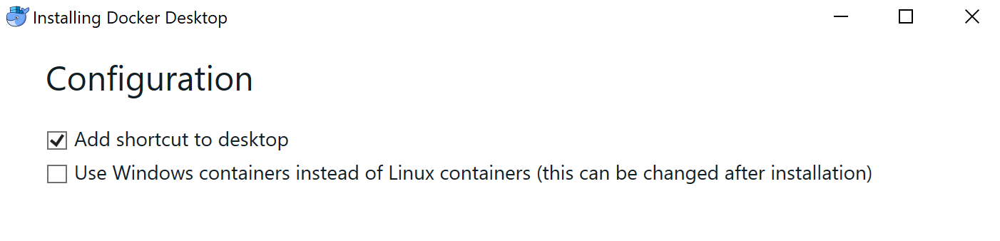
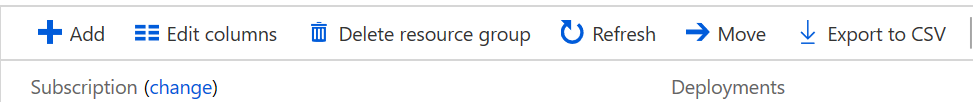
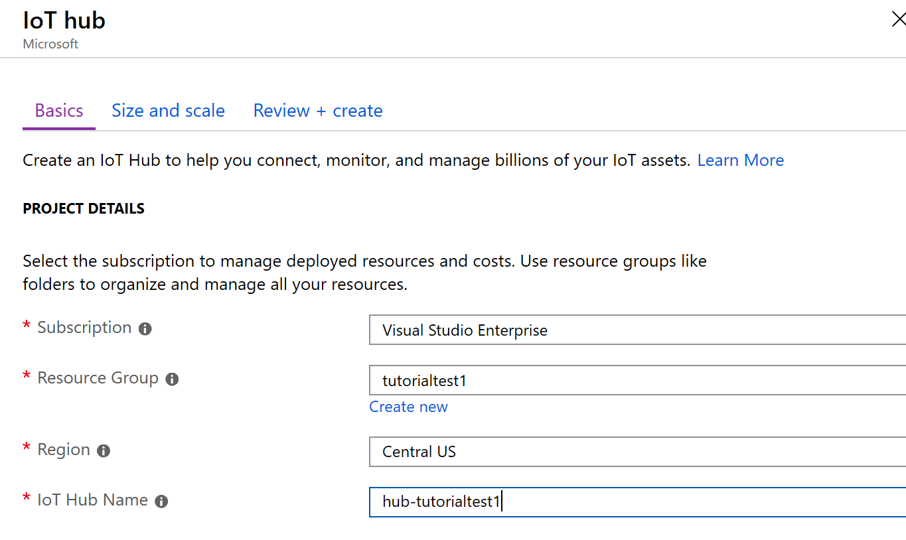
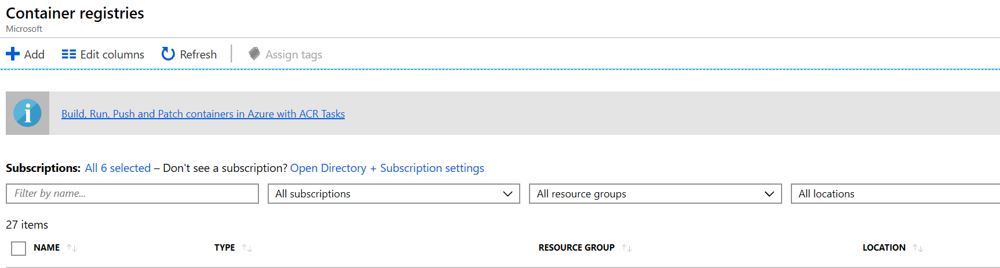

# Setting up the Azure Cloud Services

## Purpose
This page provides the common steps required to setup the environment for using Azure Services and Visual Studio. These steps will enable you to set up the related Azure cloud components and tools required to work with this tutorial.

## Prerequisites
### 1. [Download Visual Studio Code](https://code.visualstudio.com/)

This tutorial uses Visual Studio Code to connect to your device and hub to deploy modules.

You will also need to install Visual Code Extensions. To find them, open Visual Studio Code and select the square **Extensions** icon. Search for and install the following:

* Azure Account
* Azure IoT Device Workbench
* Azure IoT Edge
* Azure IoT Hub Toolkit
* Azure IoT Tools
* Anaconda Extension

### 2. Download Docker Desktop CE for [Windows](https://docs.docker.com/docker-for-windows/install/) or [Mac](https://docs.docker.com/docker-for-mac/). For Windows, do *not* check the box to use Windows containers rather than Linux containers.

* You will need to create a Docker account if you do not already have one.

This installer is ~500MB so it will take a while to download over Wi-Fi (about 30 minutes).

### *Note*

* *The installer will log you out immediately after the install is complete. This is okay.*

* *If you would like to learn more about Docker, see the Resources section at the bottom of the document.*

### 3. An Azure Account Subscription (with pre-paid credits or billing through existing payment channels)

## Overview on how to set up the Azure portal

### Create an Azure account by following [this tutorial](https://azure.microsoft.com/en-us/free/)
* Your subscription must have pre-paid credits or bill through existing payment channels. (If you make an account for the first time, you can get 12 months free and $200 in credits to start with.)

### Create a resource group
* In your Azure portal on the left side, go to **Resource Groups** and choose **Add**.

    
*  Select the subscription that came with your Azure account and name your resource group using only lowercase alphanumeric characters. This is important because some later parts of this setup may be sensitive to non-alphanumeric and/or uppercase characters.

    * **Important:** Take note of the subscription, resource group and resource data center location you selected. You should use the same location for the following resources you create.
    
* After you have created the resource group, select it.

### Create an IoT hub

* Within your resource group, from the navigation bar at the top, select **Add** and search for **"IoT Hub"**.
    * Select **Create**.

* Fill out the fields with the information you recently gathered
    * Subscription: Same as in the previous step
    * Resource Group: Same as in the previous step
    * Region: Same as in the previous step
    * IoT Hub Name: Choose a name

* Keep all the other defaults and select **Review + Create** then select **Create**.

### Create a container registry
* In the search bar at the top of the page, search **Container Registry** and select it.

* In the top navigation bar, select **Add**.

* Fill out the necessary fields
    * Name: What you want your container to be named
    * Subscription: Same as in previous step
    * Resource Group: Same as in the previous step
    * Location: Same as in previous step
    * Admin user: Enable
    * SKU: Standard

* Select **Create**.

### Create a storage account and storage container
* On the left navigation pane, select **Storage Accounts**.

* In the top navigation bar, select **Add**.

* Fill out the fields for project details
    * Subscription: Same as in previous step
    * Location: Same as in previous step
    * Name: *Must be lowercase and alphanumeric characters with a length of 3 to 24 characters*
    * Performance: Standard
    * Account kind: BlobStorage
    * Replication: Read-access geo-redundant storage (RA-GRS)
    * Access tier: Hot (default)

* Select **Create**

* In the left navigation pane in your storage account, select **Blobs**

* Select the **+ Container** button to create a new storage container (i.e. storagetest). *The name must be lowercase, alphanumeric and dash characters with a length of 3 to 63.*

* Select **OK** to finish creating the container.

**Return to the tutorial to start with Phase Two**