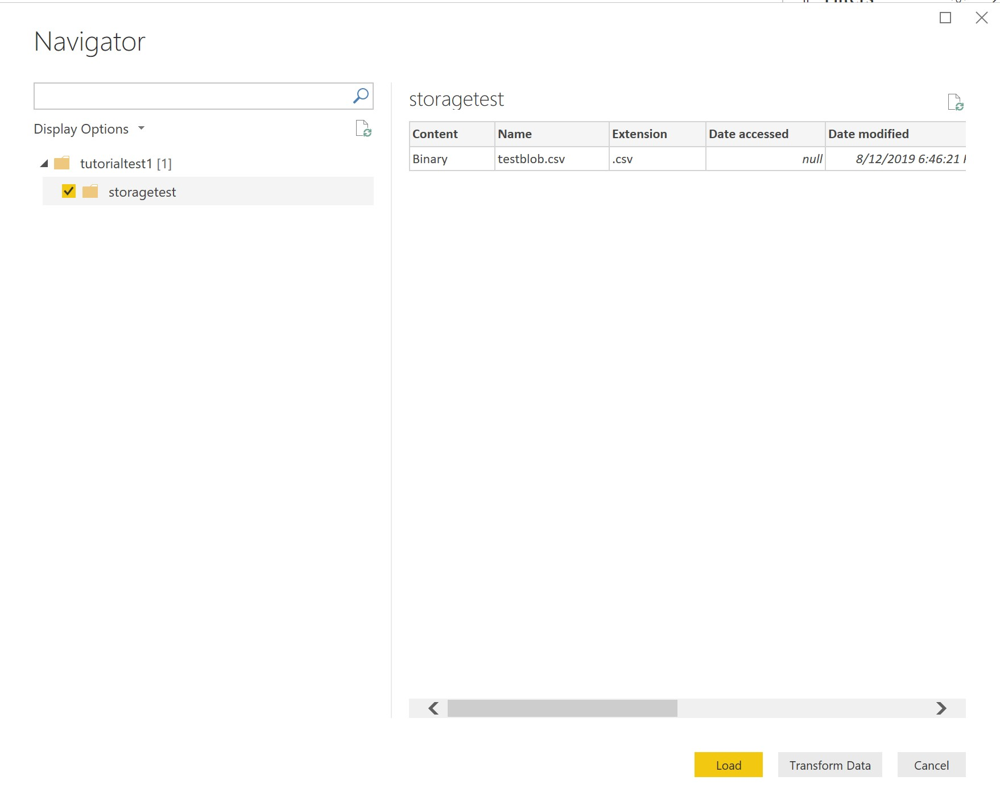
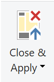

# Visualizing Data in Power BI via Azure

## Purpose
This step focuses on visualizing the data being sent from the IOT device based on the inference results captured by the model and stored in Azure Blob Storage using Power BI to display.

## Prerequisites
[Download and launch Power BI Desktop](https://powerbi.microsoft.com/en-us/desktop/)

## Visualization & Publishing

* Connect to your Azure Blob Storage Account by selecting **Get Data**.

* Follow the setup as it asks for the storage account name and connection string. The connection string can be found under **Access Keys** in your storage account resource.

* Select the container with the data you want to load.

* If you want to select any particular columns/rows or clean up any data headers (and we suggest you do this to make the visualization process easier), select **Transform Data**. Otherwise, to load all raw data, select **Load**.

<!-- Image must be changed due to namings -->

* Once the blob(s) is loaded, select **Binary** in the table to adjust the Power Query.

* After you are finished, select **Close and Apply**.

* Spend some time exploring different visualizations in Power BI and choose one you want to use for your data or [create your own](https://docs.microsoft.com/en-us/power-bi/power-bi-custom-visuals)! A good place to start is with the **New Visual** feature found on the **Home** tab.

    * For inspiration and ideas on how to visualize your data, visit [Power BI's theme gallery.](https://community.powerbi.com/t5/Themes-Gallery/bd-p/ThemesGallery)

For more details on formatting, please visit [this blog post](https://sharepointmike.wordpress.com/2015/10/03/formatting-power-bi-visualizations/) on formatting Power BI visualizations.

After you have finished making your visualization, you can **publish** your report by following [this tutorial](https://docs.microsoft.com/en-us/power-bi/desktop-upload-desktop-files).

## Troubleshooting

For help troubleshooting on Power BI, please visit [Power BI's documentation site](https://docs.microsoft.com/en-us/power-bi/) to learn more.

For technical help, please visit [Power BI's support page](https://powerbi.microsoft.com/en-us/support/).