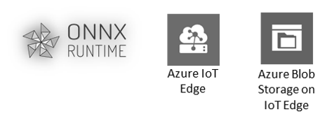

This tutorial is a reference implementation for executing ONNX models across different device platforms using the ONNX Runtime inference engine. [ONNX Runtime](https://github.com/microsoft/onnxruntime) is an open source inference engine for ONNX Models. ONNX Runtime Execution Providers (EPs) enables the execution of any ONNX model using a single set of inference APIs that provide access to the best hardware acceleration available. 

In simple terms, developers no longer need to worry about the nuances of hardware specific custom libraries to accelerate their machine learning models. This tutorial demonstrates that by enabling the same code to run on different HW platforms using their respecitive AI acceleration libraries for optimized execution of the ONNX model.

**[ONNX Runtime with TensortRT on Jetson Nano](./README-ONNXRUNTIME-arm64.md)** is the tutorial example for deploying pre-trained ONNX models on the NVIDIA Jetson Nano using Azure IoT Edge.

**[ONNX Runtime with OpenVINO](./README-ONNXRUNTIME-OpenVINO.md)** is the tutorial examle for dpeloying pre-trained ONNX models with ONNX Runtime using the OpenVINO SDK for acceleration of the model.

**[ONNX Runtime with Azure Machine Learning](./AzureML-OpenVINO/README.md)** is the example using Azure Machine Learning Service to deploy the model to an IoT Edge Device.

#### Contribution

This project was created with active contributions from [Abhinav Ayalur](https://github.com/abhi12-ayalur), [Angela Martin](https://github.com/t-anma), [Kaden Dippe](https://github.com/Kaden-Dippe), [Kelly Lin](https://github.com/kemichi), [Lindsey Cleary](https://github.com/lindseyc) and [Priscilla Lui](https://github.com/priscillalui)

This project welcomes contributions and suggestions. Most contributions require you to
agree to a Contributor License Agreement (CLA) declaring that you have the right to,
and actually do, grant us the rights to use your contribution. For details, visit
https://cla.microsoft.com.
 
When you submit a pull request, a CLA-bot will automatically determine whether you need
to provide a CLA and decorate the PR appropriately (e.g., label, comment). Simply follow the
instructions provided by the bot. You will only need to do this once across all repositories using our CLA.
